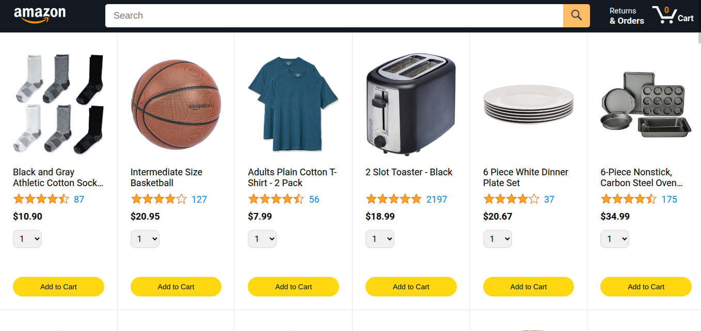
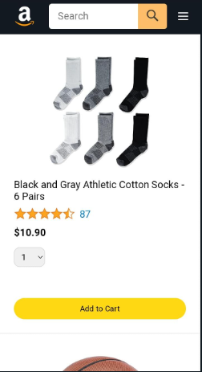

# Amazon Clone

Welcome to the Amazon Clone project! This is a fully responsive website built using HTML, CSS, and JavaScript, designed to replicate the look and feel of an E-commerce Website. The project demonstrates front-end web development skills, including responsive design, layout structuring, and dynamic interaction.

## Table of Contents

- [How It Works](#how-it-works)
- [Features](#features)
- [Technologies Used](#technologies-used)
- [Installation](#installation)
- [Usage](#usage)
- [Screenshots](#screenshots)
- [Visit Website](#visit-the-website)

## How It Works

The Amazon Clone allows users to explore a wide range of products. Each product can be selected along with its specific quantity and variations, offering a tailored shopping experience. After choosing their desired items, users can proceed to place an order seamlessly. Once the order is confirmed, they are provided with a tracking option that enables them to stay updated on the status of their purchase, ensuring a complete and efficient shopping experience.

## Features

- **Responsive Design**: Fully optimized for desktop, tablet, and mobile views.
- **Dynamic Components**: Includes interactive UI elements created with JavaScript.
- **Structured Layout**: Mimics Amazon's structure, including:
  - Header with navigation bar
  - Search bar
  - Product cards
- **Hover Effects**: Adds interactivity to buttons and links.

## Technologies Used

- **HTML**: For the structure and semantic elements.
- **CSS**: For styling and responsive design.
- **JavaScript**: For dynamic functionality and interactivity.

## Installation

Follow these steps to clone and run the project locally:

1. Clone the repository:
   ```bash
   git clone https://github.com/HasnainRaza026/Amazon-Clone.git
   ```
2. Navigate to the project directory:
   ```bash
   cd Amazon-Clone
   ```
3. Open the `index.html` file in your browser to view the website:
   - You can double-click `index.html`, or
   - Use a live server extension in your code editor (e.g., VS Code Live Server).

## Usage

Explore the Amazon Clone website to experience its features:

- **Browse the Homepage**: Navigate through the sections resembling Amazon or Other E-commerce Website.
- **Search Bar**: Interact with the search bar to search any product.
- **Responsive Design**: Resize the browser window to see the layout adapt to different screen sizes.

## Screenshots

### Desktop View:



### Mobile View:



## Acknowledgments

- Inspired by the Amazon Website.
- Special thanks to online resources that helped make this project possible.

## Visit the Website

You can view the hosted project here: [Amazon Clone](https://HasnainRaza026.github.io/Amazon-Clone)
